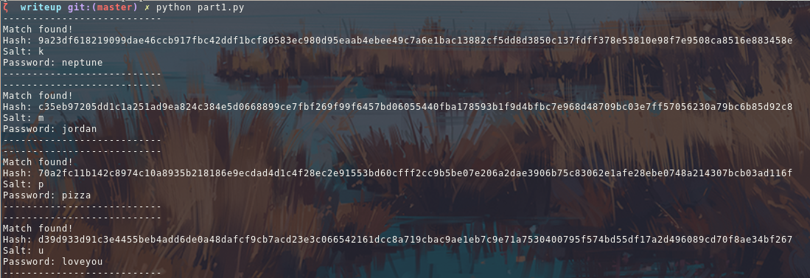

Writeup 9 - Crypto I
=====

Name: Evan McIntire
Section: 0201

I pledge on my honor that I have not given or received anyunauthorized assistance on this assignment or examination.

Digital acknowledgement of honor pledge: Evan McIntire

## Assignment 9 Writeup

### Part 1 (60 Pts)

Overall, this part was straigtforward. We load all the passwords and hashes into arrays, and then for each salt, loop through all passwords, and then check the hashed, salted password against each of our given hashes.

### Part 2 (40 Pts)

This was a bit trickier. I initially thought that the questions were hardcoded, but upon running the script more time, I saw that it was randomized, so I had to come up with a way of parsing the data from the server.

For the first question, I noticed that it would ask `Find me the <algorithm> hash of <string>`, so I wrote regex to match it, and then use `hashlib` to get the correct hash.

Then, I had the socket send it, and after some difficulty of remebering to append the '\n', I got a response from the server that it was right, with another hash listed.

So, I figured that it'd probably keep asking questions in this format, so I stuck the whole thing in a while loop, and let it run.

It instantly got the right answer for all of them, and gave the flag

`You win! CMSC389R-{H4sh-5l!ngInG-h@sH3r}`

After that, I cleaned up the code a little, removing some unneeded output, and adding a more graceful exit.